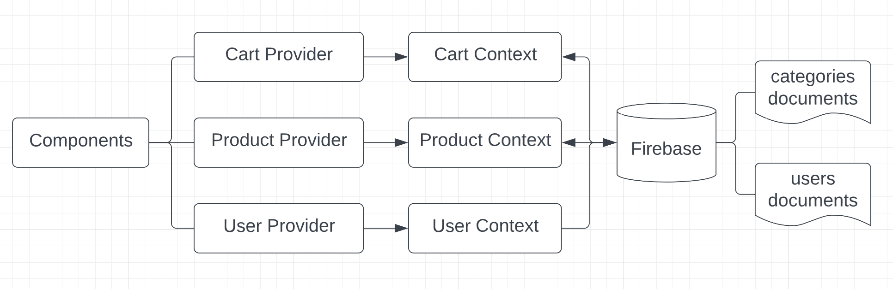

# timone-garden

An two-layer online shopping web application built by **React 18**, **Google Firebase Authentication**, **Google Firestore** and **SASS**. React front-end application directly communicates with Cloud Firestore database.


## Features

- Sign in/Sign out
- Sign in with Google Account
- Sign up
- Browse items by categories
- View one item
- Add one item to cart
- Check brief cart information in a pop-up modal by clicking bag icon on top right corner
- Go check out
- See items details including name, price, buying quantity, total price of one item in Check Out page
- Remove one item in Check Out page
- See total amount of all items in Cart
- Go checkout and pay with credit card

## Installation

- Clone the repo:
  `$ git clone https://github.com/yatingsong7/timone-garden.git`

- Go to the project directory and install packages:  
  `$cd timone-garden && npm install`

- To Start web application, go to the Front-end folder and run:
  `$ npm start`

This step will automatically open the browser, or if not, go to localhost:3000 in your browser

## Project Structure



## Key Packages

```
react 18.2.0
sass
firebase^9.8.4
```
